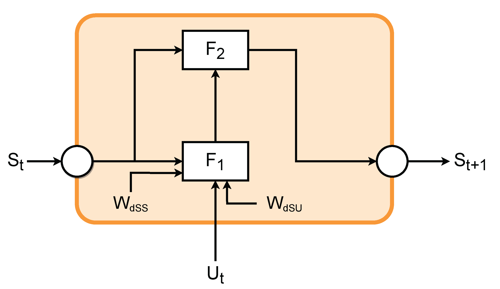
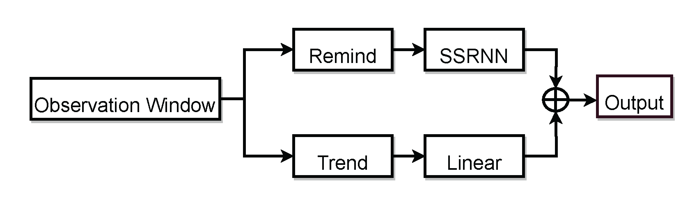
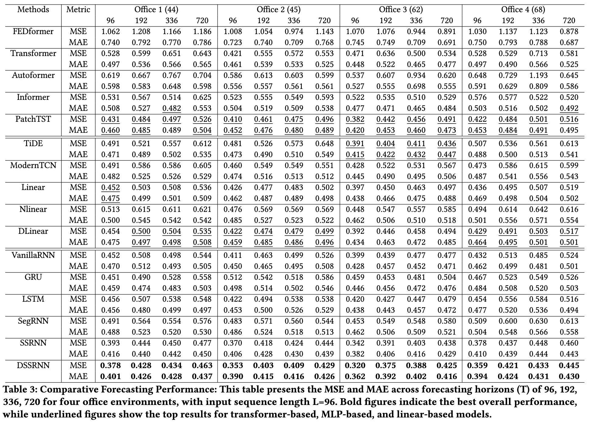
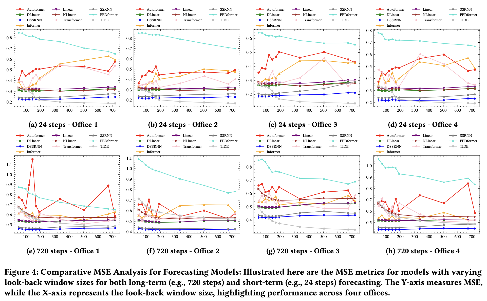

# DSSRNN: Decomposition-Enhanced State-Space Recurrent Neural Network for Time-Series Analysis
This repository contains the implementation of the Decomposition State-Space Recurrent Neural Network (DSSRNN), a novel framework designed for accurate long-term and short-term forecasting in time-series analysis. DSSRNN innovatively integrates decomposition analysis with state-space models and physics-based equations, focusing on improving forecasting accuracy and computational efficiency, particularly in predicting indoor air quality levels.






## Project Structure
Below is the structure of this repository, detailing the primary components and their purpose:
```
├── data_provider/ # Modules for data preprocessing and loading
├── dataset/ # Directory for dataset storage
├── DSSRNN-classification/ # Implementation of DSSRNN for classification tasks
├── DSSRNN-imputation/ # Implementation of DSSRNN for data imputation
├── exp/ # Experiment scripts and configuration files
├── FEDformer/
├── layers/ # Custom neural network layers used in models
├── models/ # Directory containing different model implementations
├── results/ # Output folder for results and model checkpoints
├── scripts/ # Utility scripts for various tasks
├── utils/ # Helper functions and utility modules
├── .gitignore # Specifies intentionally untracked files to ignore
├── get-pip.py # Script to install pip
├── ReadMe.md
└── requirements.txt # List of dependencies to install
```
## Results

Our DSSRNN model has been rigorously tested against various benchmarks and has shown significant improvements in both short-term and long-term forecasting tasks. 

- **Performance Metrics**: 




- **Computational Efficiency**: 


