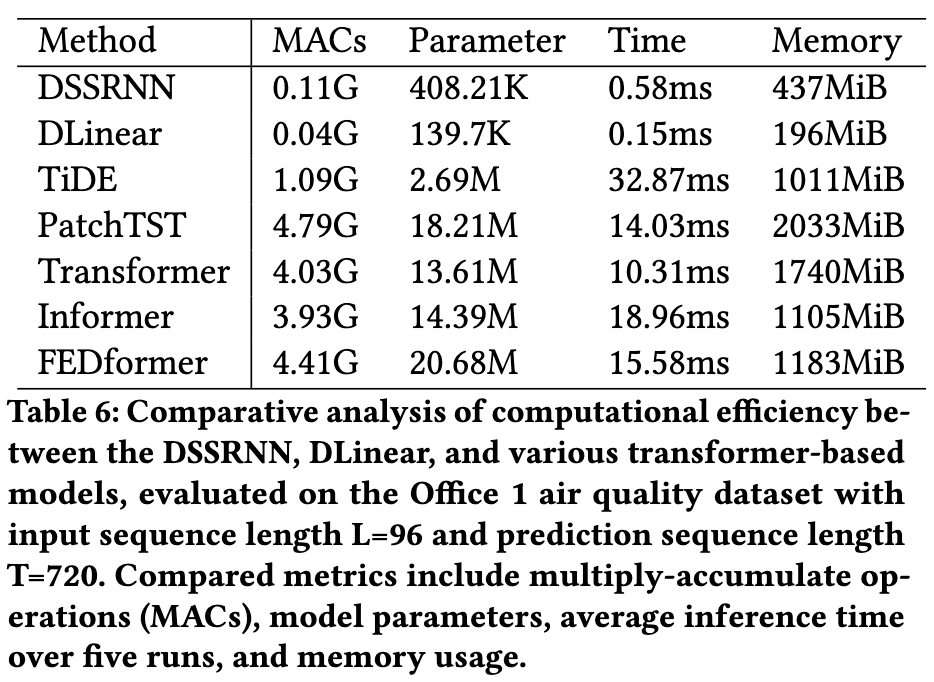

# DSSRNN: Decomposition-Enhanced State-Space Recurrent Neural Network for Time-Series Analysis
This repository contains the implementation of the Decomposition State-Space Recurrent Neural Network (DSSRNN), a novel framework designed for accurate long-term and short-term forecasting in time-series analysis. DSSRNN innovatively integrates decomposition analysis with state-space models and physics-based equations, focusing on improving forecasting accuracy and computational efficiency, particularly in predicting indoor air quality levels.


## Project Structure
Below is the structure of this repository, detailing the primary components and their purpose:
```
├── data_provider/ # Modules for data preprocessing and loading
├── dataset/ # Directory for dataset storage
├── DSSRNN-classification/ # Implementation of DSSRNN for classification tasks
├── DSSRNN-imputation/ # Implementation of DSSRNN for data imputation
├── exp/ # Experiment scripts and configuration files
├── FEDformer/
├── layers/ # Custom neural network layers used in models
├── models/ # Directory containing different model implementations
├── results/ # Output folder for results and model checkpoints
├── scripts/ # Utility scripts for various tasks
├── utils/ # Helper functions and utility modules
├── .gitignore # Specifies intentionally untracked files to ignore
├── get-pip.py # Script to install pip
├── ReadMe.md
└── requirements.txt # List of dependencies to install
```

## Detailed Description
Our script files for the experiment are located in `./scripts`:
| Files      |                              Interpretation                          |
| ------------- | -------------------------------------------------------| 
| /co2.sh    | A single experiment using DSSRNN on a single dataset                    |
| EXP-Embedding/co2_all2.sh      | Experiments on all the datasets for the linear models   | 
| EXP-Embedding/co2_all.sh        | experiments on all the dataset for the transformers      |

The models and the experiments can be modified according to your preference.

This code is simply built on the code base of LTSF-Linear. We appreciate the following GitHub repos a lot for their valuable code bases:

The implementation of LTSF-Linear is from https://github.com/cure-lab/LTSF-Linear

The implementation of Autoformer, Informer, and Transformer is from https://github.com/thuml/Autoformer

The implementation of FEDformer is from https://github.com/MAZiqing/FEDformer

## Getting Started
### Environment Requirements

Please confirm that Conda has been installed first. After that, our environment may be set up by:

```
conda create -n DSSRNN python=3.6.9
conda activate DSSRNN
pip install -r requirements.txt
```

### Data Preparation

The data is available in the `./dataset` directory.

### Training Example
As mentioned before, all the available training scripts are located in `./scripts`.

For example:

To train the **DSSRNN** on **ds44**, you can use the script `scripts/co2.sh`:
```
sh scripts/co2.sh
```
It will start to train DSSRNN by default, the results will be shown in `logs/LongForecasting`. You can specify the name of the model in the script. (SSRNN, Linear, DLinear, NLinear)

There are other scripts available in `scripts` and The default look-back window in scripts is 96.

Other scripts can also be used using their respective directory. Additionally, you can `cd FEDformer` to run the scripts related to FEDfomer.


## Results

Our DSSRNN model has been rigorously tested against various benchmarks and has shown significant improvements in both short-term and long-term forecasting tasks. 

- **Performance Metrics**: 


- **Computational Efficiency**: 



